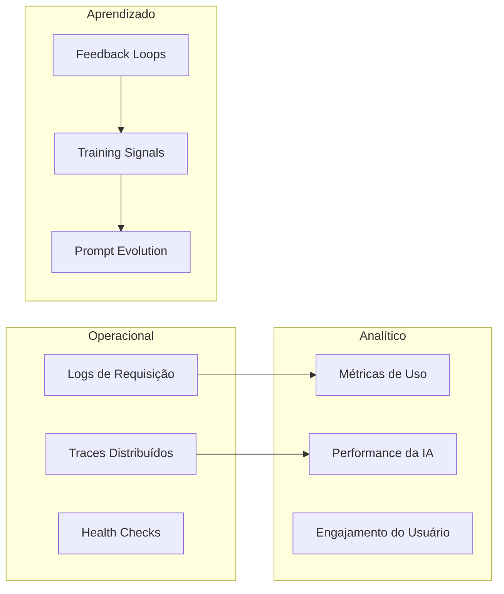
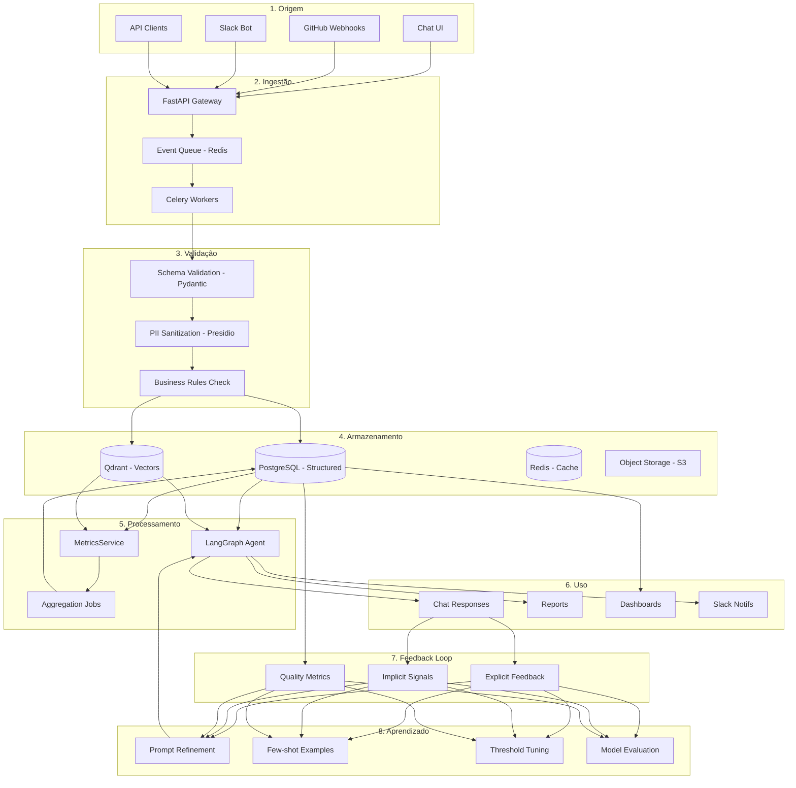
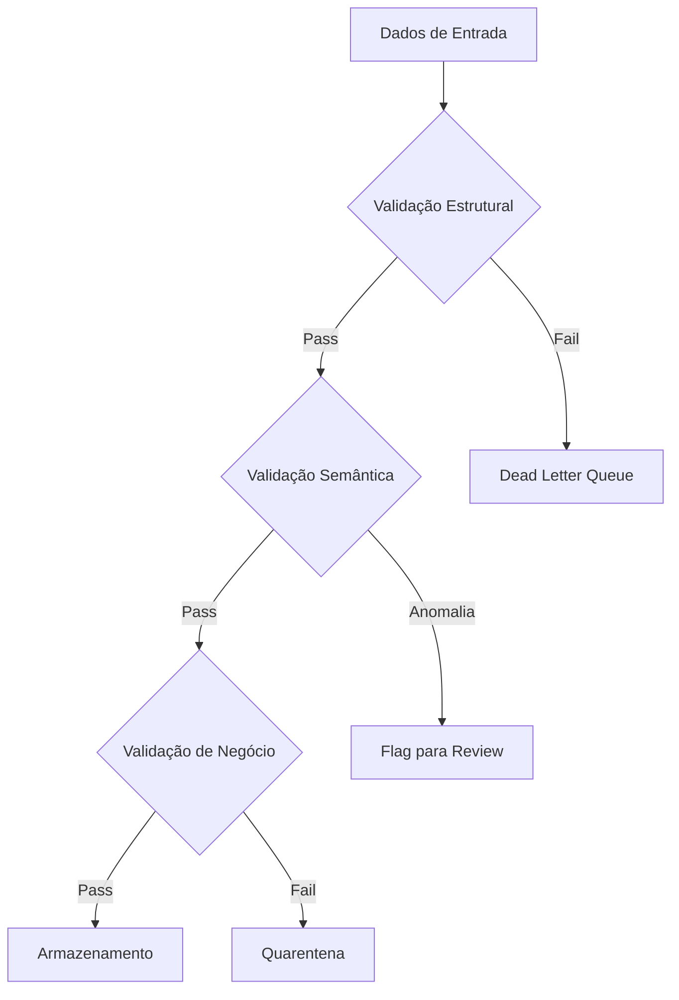
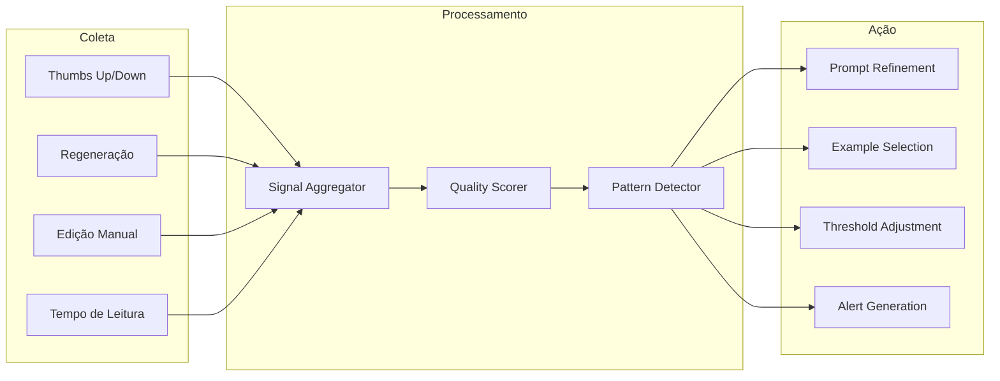

# Estratégia de Fluxo de Dados para Aprendizado Contínuo

> **Contexto**: Este documento define o plano estratégico e operacional de como o DevBridge deve coletar, processar, armazenar, evoluir e utilizar dados para garantir qualidade, observabilidade e aprendizado incremental contínuo.

---

## 1. Taxonomia de Dados

### 1.1 Tipos de Dados a Coletar

| Categoria | Tipo de Dado | Descrição | Volume Esperado |
|-----------|--------------|-----------|-----------------|
| **Eventos** | Interações de Chat | Mensagens enviadas, tokens consumidos, tempo de resposta | Alto (~10K/dia) |
| **Eventos** | Webhooks GitHub | Commits, PRs, Issues, Code Reviews | Médio (~1K/dia) |
| **Eventos** | Navegação UI | Page views, cliques, tempo em tela | Alto (~50K/dia) |
| **Feedback** | Explícito | Thumbs up/down, ratings, correções | Baixo (~100/dia) |
| **Feedback** | Implícito | Regenerações, edições de resposta, abandono | Médio (~500/dia) |
| **Contexto** | Configuração | `.devbridge.yaml`, personas, tenants | Estático (refresh diário) |
| **Contexto** | Histórico de Conversa | Threads, contexto acumulado | Médio (~2K/dia) |
| **Decisões** | Outputs da IA | Traduções, classificações, value tags | Alto (~5K/dia) |
| **Decisões** | Roteamento | Query classification, persona selection | Alto (~10K/dia) |
| **Métricas** | DORA/SPACE | Lead time, deploy frequency, cycle time | Agregado (diário) |
| **Métricas** | Qualidade de Resposta | Latência, confiança, tokens | Por request |

### 1.2 Classificação por Finalidade



| Dado | Operacional | Analítico | Aprendizado |
|------|:-----------:|:---------:|:-----------:|
| Chat Messages | ✓ | ✓ | ✓ |
| Feedback Explícito | | ✓ | ✓✓ |
| Feedback Implícito | | ✓ | ✓ |
| Query Classification | ✓ | ✓ | ✓ |
| AI Outputs | ✓ | ✓ | ✓✓ |
| Latency Metrics | ✓ | ✓ | |
| Error Traces | ✓ | | |

> **Legenda**: ✓ = uso primário, ✓✓ = uso crítico

---

## 2. Fluxo de Dados Ponta-a-Ponta

### 2.1 Pipeline Completo



### 2.2 Detalhamento por Etapa

#### Etapa 1: Origem dos Dados

| Origem | Protocolo | Formato | SLA Ingestão |
|--------|-----------|---------|--------------|
| Chat UI | HTTPS/WSS | JSON | < 100ms |
| GitHub Webhooks | HTTPS POST | JSON | < 500ms |
| Slack Commands | HTTPS POST | Form/JSON | < 3s |
| Batch Imports | S3/API | CSV/JSONL | < 1h |

#### Etapa 2: Ingestão

```python
# Padrão de ingestão unificado
class IngestionEvent(BaseModel):
    source: Literal["chat", "github", "slack", "api"]
    event_type: str
    org_id: UUID
    user_id: Optional[UUID]
    payload: dict
    timestamp: datetime
    trace_id: str

    class Config:
        json_schema_extra = {
            "example": {
                "source": "chat",
                "event_type": "message.sent",
                "trace_id": "trace-abc123"
            }
        }
```

> [!IMPORTANT]
> Todo evento de ingestão **DEVE** conter `trace_id` para rastreabilidade E2E.

#### Etapa 3: Validação

| Validação | Ferramenta | Ação em Falha |
|-----------|------------|---------------|
| Schema | Pydantic v2 | Reject + Log |
| PII Detection | Presidio | Redact + Continue |
| Business Rules | Custom Validators | Flag + Continue |
| Rate Limiting | Redis | Block temporário |

#### Etapa 4: Armazenamento

**PostgreSQL (Hot Data)**
```sql
-- Tabela de eventos para análise
CREATE TABLE events (
    id UUID PRIMARY KEY,
    org_id UUID NOT NULL,
    event_type VARCHAR(100) NOT NULL,
    payload JSONB,
    metadata JSONB,
    created_at TIMESTAMPTZ DEFAULT NOW(),
    -- Particionamento por tempo
    CONSTRAINT events_partition_key PRIMARY KEY (id, created_at)
) PARTITION BY RANGE (created_at);

-- Índices para queries frequentes
CREATE INDEX idx_events_org_type ON events (org_id, event_type);
CREATE INDEX idx_events_time ON events (created_at DESC);
```

**Qdrant (Semantic)**
- Collection: `chat_interactions`
- Dimensions: 1536 (text-embedding-3-small)
- Metadata: `org_id`, `persona`, `feedback_score`, `timestamp`

**Retenção**:
| Camada | Período | Ação após expirar |
|--------|---------|-------------------|
| Hot (PostgreSQL) | 90 dias | Arquivar → Cold |
| Cold (S3) | 1 ano | Agregar → Summary |
| Vectors (Qdrant) | Permanente | Prune low-utility |

#### Etapa 5: Uso

| Caso de Uso | Fonte Principal | Fonte Secundária | Latência Target |
|-------------|-----------------|------------------|-----------------|
| Chat Response | Qdrant | PostgreSQL | < 2s |
| Weekly Report | PostgreSQL | Qdrant | < 30s |
| Real-time Dashboard | Redis Cache | PostgreSQL | < 500ms |
| Trend Analysis | Aggregated Tables | Raw Events | < 5s |

---

## 3. Garantia de Qualidade de Dados

### 3.1 Validação em Múltiplas Camadas



### 3.2 Esquema de Versionamento

```yaml
# event_schema_v1.yaml
version: "1.0.0"
event_type: "chat.message"
schema:
  content:
    type: string
    max_length: 10000
    required: true
  persona:
    type: enum
    values: ["CEO", "CTO", "PRODUCT"]
    default: "PRODUCT"
```

**Política de Breaking Changes**:
1. Novos campos → `default` obrigatório
2. Campos removidos → 30 dias de deprecation
3. Mudança de tipo → Nova versão do schema

### 3.3 Rastreabilidade

| Dimensão | Implementação |
|----------|---------------|
| **Trace ID** | Propagado via headers (`X-Trace-ID`) |
| **Event Lineage** | Campo `parent_event_id` em eventos derivados |
| **Schema Version** | Campo `_schema_version` em todos os eventos |
| **Processing Log** | Audit log de cada transformação |

### 3.4 Descarte e Limpeza

| Regra | Trigger | Ação |
|-------|---------|------|
| PII não-sanitizado | Presidio detection | Quarentena imediata |
| Eventos duplicados | Hash match | Descarte silencioso |
| Schema inválido | Pydantic validation | DLQ + alerta |
| Dados expirados | TTL policy | Arquivamento |

---

## 4. Evolução Contínua e Feedback Loop

### 4.1 Arquitetura do Feedback Loop



### 4.2 Sinais de Feedback

| Sinal | Tipo | Peso | Captura |
|-------|------|------|---------|
| Thumbs Up | Explícito | +1.0 | UI button |
| Thumbs Down | Explícito | -1.0 | UI button |
| Regeneração | Implícito | -0.5 | API retry detection |
| Cópia do texto | Implícito | +0.3 | Clipboard event |
| Edição pelo usuário | Implícito | -0.3 | Text diff detection |
| Resposta longa lida | Implícito | +0.2 | Scroll + dwell time |
| Abandono | Implícito | -0.7 | Session end sem ação |

### 4.3 Retroalimentação do Sistema

```python
class FeedbackProcessor:
    """
    Processa feedback e atualiza componentes do sistema.
    """

    async def process_feedback(
        self,
        feedback: FeedbackEvent
    ) -> list[SystemUpdate]:
        updates = []

        # 1. Atualiza score do exemplo no few-shot pool
        if feedback.is_negative:
            updates.append(
                UpdateFewShotWeight(
                    example_id=feedback.response_id,
                    delta=-0.1
                )
            )

        # 2. Detecta padrões de erro recorrentes
        pattern = await self.detect_pattern(feedback)
        if pattern and pattern.frequency > THRESHOLD:
            updates.append(
                CreatePromptRefinement(
                    pattern=pattern,
                    suggested_change=pattern.suggested_fix
                )
            )

        # 3. Atualiza métricas de qualidade da persona
        updates.append(
            UpdatePersonaQuality(
                persona=feedback.persona,
                metric="satisfaction",
                value=feedback.score
            )
        )

        return updates
```

### 4.4 Aprendizado sem Degradação

| Mecanismo | Propósito | Implementação |
|-----------|-----------|---------------|
| **A/B Testing** | Validar mudanças antes de rollout | Feature flags + cohort split |
| **Canary Deployment** | Detectar regressões cedo | 5% traffic → monitor → scale |
| **Quality Gates** | Impedir degradação | Threshold checks antes de deploy |
| **Rollback Automático** | Reverter mudanças ruins | Quality score < baseline → revert |
| **Human-in-the-Loop** | Validar mudanças críticas | Review queue para low-confidence |

**Quality Score Calculation**:
```python
def calculate_quality_score(
    responses: list[Response],
    period: timedelta = timedelta(days=7)
) -> float:
    """
    Score composto de qualidade.
    Threshold mínimo: 0.75
    """
    metrics = {
        "explicit_positive": count_positive_feedback(responses),
        "explicit_negative": count_negative_feedback(responses),
        "implicit_positive": count_implicit_positive(responses),
        "implicit_negative": count_implicit_negative(responses),
        "latency_p95": calculate_p95_latency(responses),
        "token_efficiency": calculate_token_efficiency(responses),
    }

    return (
        (metrics["explicit_positive"] * 1.0 +
         metrics["implicit_positive"] * 0.5 -
         metrics["explicit_negative"] * 1.0 -
         metrics["implicit_negative"] * 0.3) /
        len(responses) *
        (1 - (metrics["latency_p95"] / 5000))  # Penalty for slow responses
    )
```

---

## 5. Métricas e Sinais de Saúde

### 5.1 Dashboard de Observabilidade

| Categoria | Métrica | Target | Alerta |
|-----------|---------|--------|--------|
| **Qualidade** | Satisfaction Rate | > 85% | < 75% |
| **Qualidade** | Regeneration Rate | < 10% | > 20% |
| **Qualidade** | Error Rate | < 1% | > 5% |
| **Utilidade** | Questions Answered | > 90% | < 80% |
| **Utilidade** | Report Adoption | > 70% | < 50% |
| **Cobertura** | Data Freshness | < 1h | > 6h |
| **Cobertura** | Context Coverage | > 80% | < 60% |
| **Impacto** | Time Saved (estimado) | > 2h/user/week | < 30min |
| **Impacto** | Decisões Informadas | > 5/user/week | < 2 |

### 5.2 Métricas de Pipeline

```yaml
# Prometheus metrics
devbridge_events_ingested_total:
  type: counter
  labels: [source, event_type, org_id]

devbridge_events_processed_duration_seconds:
  type: histogram
  buckets: [0.1, 0.5, 1, 2, 5, 10]

devbridge_feedback_score:
  type: gauge
  labels: [persona, period]

devbridge_data_quality_score:
  type: gauge
  labels: [data_type, validation_stage]
```

### 5.3 SLOs e Error Budget

| SLO | Target | Error Budget (30d) |
|-----|--------|-------------------|
| Availability | 99.5% | 3.6h downtime |
| Latency (p95) | < 3s | 5% requests > 3s |
| Data Freshness | < 30min | 1% > 30min |
| Quality Score | > 0.75 | 10% < 0.75 |

---

## 6. Riscos e Trade-offs Arquiteturais

### 6.1 Matriz de Riscos

| Risco | Probabilidade | Impacto | Mitigação |
|-------|---------------|---------|-----------|
| **Feedback poisoning** | Baixa | Alto | Rate limiting + anomaly detection |
| **Concept drift** | Média | Médio | Monitoring + periodic retraining |
| **Data staleness** | Média | Médio | Cache invalidation + freshness alerts |
| **Storage explosion** | Média | Baixo | Tiered storage + aggressive TTL |
| **Privacy leak** | Baixa | Crítico | Presidio + audit logs + encryption |
| **Model degradation** | Média | Alto | Quality gates + A/B testing |

### 6.2 Trade-offs Explícitos

| Trade-off | Decisão | Justificativa |
|-----------|---------|---------------|
| Latência vs Qualidade | Favorece qualidade para reports, latência para chat | Contexto de uso diferente |
| Storage Cost vs Granularidade | Alta granularidade (90d) + agregação (1y) | Balanceia análise vs custo |
| Automação vs Controle | Human-in-the-loop para mudanças de prompt | Evita degradação silenciosa |
| Privacidade vs Utilidade | Sanitização agressiva | Compliance > features |
| Simplicidade vs Flexibilidade | Schemas rígidos | Previsibilidade > flexibilidade |

### 6.3 Débitos Técnicos Conhecidos

| Débito | Impacto | Plano de Mitigação |
|--------|---------|-------------------|
| Feedback storage não-estruturado | Query complexity | Migrar para schema dedicado (Q2) |
| Sem feature store | Duplicação de lógica | Avaliar Feature Store (Q3) |
| Metrics em código | Acoplamento | Extrair para config (Q2) |

---

## 7. Roadmap de Implementação

### Fase 1: Fundação (Sprint 1-2)
- [ ] Implementar schema de eventos unificado
- [ ] Criar tabela `feedback` com schema estruturado
- [ ] Adicionar `trace_id` a todos os endpoints
- [ ] Configurar métricas Prometheus básicas

### Fase 2: Coleta (Sprint 3-4)
- [ ] Implementar captura de feedback implícito (regeneração, edição)
- [ ] Criar pipeline de agregação diária
- [ ] Implementar Dead Letter Queue para eventos inválidos
- [ ] Adicionar dashboards Grafana

### Fase 3: Aprendizado (Sprint 5-6)
- [ ] Implementar `FeedbackProcessor`
- [ ] Criar sistema de few-shot dinâmico baseado em feedback
- [ ] Implementar A/B testing framework
- [ ] Quality gates para prompt changes

### Fase 4: Otimização (Sprint 7-8)
- [ ] Implementar tiered storage (Hot/Cold)
- [ ] Automação de arquivamento
- [ ] Anomaly detection para feedback
- [ ] Self-healing para pipelines

---

## 8. Anexos

### A. Glossário

| Termo | Definição |
|-------|-----------|
| **Feedback Explícito** | Ação deliberada do usuário (thumbs, rating) |
| **Feedback Implícito** | Comportamento inferido (regeneração, abandono) |
| **Quality Gate** | Checkpoint que impede deploy se métricas abaixo do threshold |
| **Few-shot** | Exemplos incluídos no prompt para guiar a IA |
| **Concept Drift** | Mudança gradual na distribuição de dados/comportamento |

### B. Referências

- [Data Mesh Principles](https://martinfowler.com/articles/data-mesh-principles.html)
- [Feedback Loops in ML Systems](https://research.google/pubs/pub43146/)
- [Observability Engineering - O'Reilly](https://www.oreilly.com/library/view/observability-engineering/9781492076438/)
