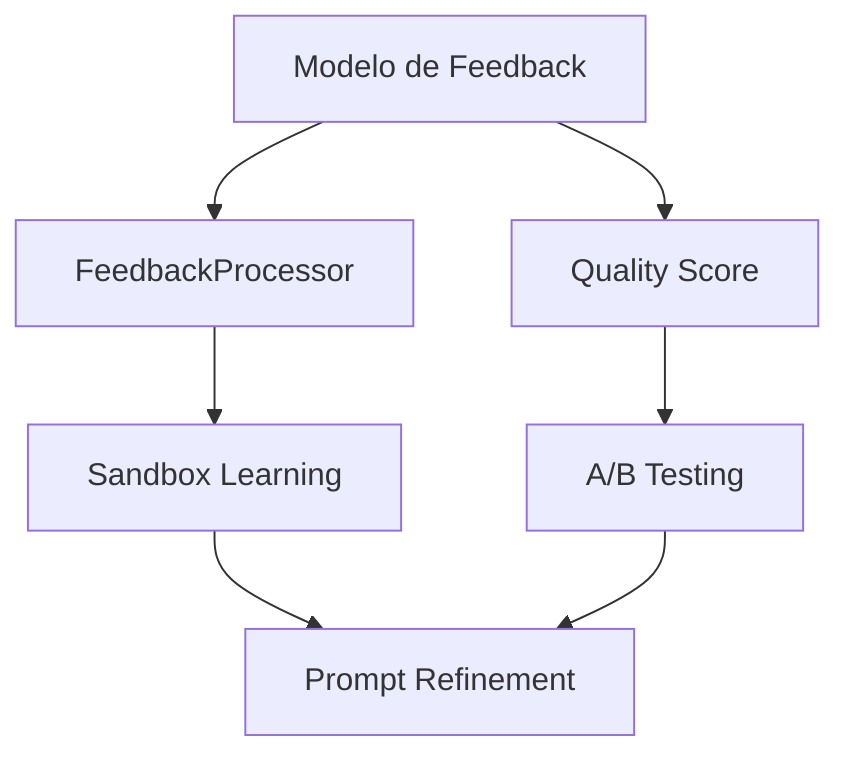

# Plano de Execução: Aprendizado Contínuo Governado

> **Versão**: 1.1 | **Data**: 2026-01-17 | **Autor**: Arquiteto Principal de Dados
> **Referência**: [Estratégia de Fluxo de Dados](continuous-learning-data-strategy.md)
> **Changelog v1.1**: Adição de idempotência, rastreabilidade de geração, sandbox para aprendizado e funil de feedback.

---

## 1. Análise de Lacunas Críticas

### 1.1 Inventário: O Que Existe vs. O Que Falta

| Componente | Status | Localização | Observação |
|------------|--------|-------------|------------|
| Trace ID Middleware | ✅ Existe | `app/core/middleware.py` | Propagação via `X-Trace-ID` funcional |
| Modelo de Conversa | ✅ Existe | `app/models/conversation.py` | `ChatMessage` sem campos de feedback |
| Presidio (PII) | ✅ Existe | `app/services/privacy_service.py` | Sanitização ativa |
| Qdrant (Vectors) | ✅ Existe | `app/services/vector_service.py` | Embeddings funcionais |
| PostgreSQL (Dados) | ✅ Existe | Migrations via Alembic | Schema atual suficiente |
| **Modelo de Feedback** | ❌ Não existe | — | Crítico para aprendizado |
| **FeedbackProcessor** | ❌ Não existe | — | Engine de processamento |
| **Tabela de Eventos** | ❌ Não existe | — | Ingestão unificada (Minimal necessária) |
| **Quality Score** | ❌ Não existe | — | Métrica central |
| **Few-shot Management** | ❌ Não existe | — | Prompt dinâmico |
| **A/B Testing** | ❌ Não existe | — | Validação de mudanças |
| **Dead Letter Queue** | ❌ Não existe | — | Eventos inválidos |
| **Dashboard Grafana** | ⚠️ Parcial | `observability/` | Sem métricas de ML |

### 1.2 Classificação de Risco por Lacuna

| Lacuna | Risco | Impacto | Justificativa |
|--------|-------|---------|---------------|
| Modelo de Feedback | **Alto** | **Crítico** | Sem ele, zero capacidade de aprendizado |
| Rastreabilidade (Lineage) | **Alto** | **Crítico** | Aprender sem saber a origem = corrupção do modelo |
| Quality Score | **Alto** | **Alto** | Sem baseline, impossível detectar degradação |
| Sandbox de Aprendizado | **Médio** | **Alto** | Rollout sem comparação é irresponsável |
| FeedbackProcessor | **Médio** | **Alto** | Automatiza o ciclo de feedback |
| A/B Testing | **Médio** | **Médio** | Sem validação controlada = risco de rollout |
| Tabela de Eventos (Min) | **Baixo** | **Médio** | Necessária para debug e lineage |

### 1.3 Dependências Críticas



> [!IMPORTANT]
> **Decisão**: O Modelo de Feedback é a **fundação** de todo o sistema de aprendizado. Nenhum outro componente pode ser implementado antes dele.

---

## 2. Plano de Execução (90 Dias)

### 2.1 Visão Geral das Fases

| Fase | Período | Objetivo Principal | Entregável-Chave |
|------|---------|-------------------|------------------|
| **Fundação** | Dias 1-30 | Infraestrutura segura | Feedback Idempotente + Eventos Min. |
| **Coleta** | Dias 31-50 | Captura de sinais | Funil de Feedback Instrumentado |
| **Observabilidade** | Dias 51-70 | Métricas confiáveis | Dashboard + Quality Score Ponderado |
| **Aprendizado v0** | Dias 71-90 | Primeiro loop seguro | Sandbox + Comparação Obrigatória |

---

### Fase 1: Fundação (Dias 1-30)

#### Objetivo
Criar a infraestrutura mínima para persistir feedback com garantia de qualidade, unicidade e rastreabilidade total.

#### Entregáveis Técnicos

| Artefato | Tipo | Descrição |
|----------|------|-----------|
| `app/models/feedback.py` | Model | Schema com idempotência e lineage |
| `app/models/event_log.py` | Model | Tabela mínima de eventos |
| `migrations/xxx_add_feedback.py` | Migration | DDL das tabelas |
| `app/schemas/feedback.py` | Pydantic | DTOs imutáveis |
| `app/api/v1/feedback.py` | Router | Endpoints POST/GET |
| `app/services/feedback_service.py` | Service | Lógica de deduplicação e pesos |
| `ADR-011-feedback-schema.md` | ADR | Decisão de design + Idempotência |

#### Schema Proposto (Refinado v1.1)

```python
# app/models/feedback.py (Conceitual)
class Feedback(Base, UUIDMixin, TimestampMixin):
    __tablename__ = "feedback"

    # Identidade e Unicidade
    idempotency_key: Mapped[str] = mapped_column(String(64), unique=True, index=True)
    # Hash(user_id + message_id + type + source)

    # Contexto e Lineage (Obrigatório)
    organization_id: Mapped[UUID] = mapped_column(ForeignKey("organizations.id"), index=True)
    user_id: Mapped[UUID] = mapped_column(ForeignKey("users.id"), nullable=True)
    message_id: Mapped[UUID] = mapped_column(ForeignKey("chat_messages.id"), index=True)
    generation_id: Mapped[str] = mapped_column(String(100), index=True) # ID interno da LLM generation
    prompt_version_id: Mapped[str] = mapped_column(String(50)) # Git hash ou version tag
    trace_id: Mapped[str] = mapped_column(String(100))

    # Feedback Value (Imutável)
    feedback_type: Mapped[FeedbackType]
    source: Mapped[FeedbackSource]

    # Scoring System
    score_raw: Mapped[float]     # Valor original (-1.0 a +1.0)
    weight: Mapped[float]        # Trust score do usuário/origem (0.0 a 1.0)
    score_effective: Mapped[float] # Persisted computed column: raw * weight

    # Metadados
    persona: Mapped[str | None] = mapped_column(String(50))
    metadata: Mapped[dict | None] = mapped_column(JSONB)
```

> [!CAUTION]
> Aprendizado sem `generation_id` ou `prompt_version_id` é **PROIBIDO**. Dados órfãos devem ser descartados do pipeline de treino.

#### Métricas de Sucesso

| Métrica | Target | Como Medir |
|---------|--------|------------|
| Deduplicação efetiva | 100% | Tentativa de duplo envio rejeitada |
| Rastreabilidade | 100% | Feedbacks com generation_id válido |
| Tabela Minimal Events | ✅ | Criada para logs críticos |

#### Critério de "Pronto para Avançar"
- [ ] Migration rodou em staging sem erros
- [ ] Constraint de idempotência verificada
- [ ] Lineage (generation/prompt) garantido na ingestão
- [ ] ADR aprovado detalhando estratégia de dedupe

---

### Fase 2: Coleta & Funil (Dias 31-50)

#### Objetivo
Expandir a coleta e instrumentar o "Funil de Feedback" para diagnosticar perdas de sinal.

#### Entregáveis Técnicos

| Artefato | Tipo | Descrição |
|----------|------|-----------|
| Frontend: Thumbs buttons | Component | Botões na UI do chat |
| Frontend: Telemetry | Lib | Rastreio de exibição de feedback |
| Backend: Implicit signal API | Endpoint | POST para sinais implícitos |
| Dashboard: Feedback Funnel | Grafana | Visualização do funil |

#### Conceito: Funil de Feedback

1. **Generated**: Resposta criada pela LLM.
2. **Displayed**: Usuário visualizou a resposta (tempo > 2s).
3. **Opportunity**: Botões de feedback renderizados.
4. **Interaction**: Usuário clicou / interagiu.
5. **Ingested**: API recebeu o evento.
6. **Persisted**: Salvo no banco com sucesso.

> **Diagnóstico**: Queda em (3) -> (4) é problema de UX. Queda em (5) -> (6) é erro de sistema.

#### Critério de "Pronto para Avançar"
- [ ] Funil instrumentado no Grafana
- [ ] Taxa de perda Ingested -> Persisted < 0.1%
- [ ] Regeneração detectada e ligada ao `generation_id` anterior

---

### Fase 3: Observabilidade Ponderada (Dias 51-70)

#### Objetivo
Métricas de qualidade que consideram confiança e volume, evitando alarmismo com dados escassos.

#### Entregáveis Técnicos

| Artefato | Tipo | Descrição |
|----------|------|-----------|
| `app/services/quality_service.py` | Service | Cálculo v1.1 (Ponderado) |
| Dashboard Grafana | Config | Painel com confiança visual |
| Agregador Diário | Job | Processamento batch de scores |

#### Quality Score v1.1 (Weighted)

```python
def calculate_quality_score_v1_1(feedbacks: list[Feedback]) -> QualityScore:
    """
    Score = (Explicit * W1 + Implicit * W2) / (TotalWeight)
    Confidence = f(SampleVolume, Variance)
    """
    # Pesos definidos por ADR
    W_EXPLICIT = 1.0
    W_IMPLICIT = 0.3

    # Score calculation logic...

    confidence_level = "low"
    if volume > 50 and variance < 0.2:
        confidence_level = "high"
    elif volume > 10:
        confidence_level = "medium"

    return QualityScore(value=score, confidence=confidence_level)
```

#### Regras de Alerta v1.1

| Alerta | Condição | Ação |
|--------|----------|------|
| Quality Degradation | Score < 0.6 AND Conf == High | PagerDuty |
| Quality Dip (Noise) | Score < 0.6 AND Conf == Low | Log (Info) |
| Funil Quebrado | Drop > 5% em Ingestão | Slack (Critical) |

#### Critério de "Pronto para Avançar"
- [ ] Dashboard distingue High/Low confidence
- [ ] Alertas não disparam para orgs com pouco uso (Low confident)
- [ ] Quality Score considera pesos diferenciados

---

### Fase 4: Aprendizado v0 com Sandbox (Dias 71-90)

#### Objetivo
Implementar loop de aprendizado com ambiente isolado para verificação (Sandbox).

#### Entregáveis Técnicos

| Artefato | Tipo | Descrição |
|----------|------|-----------|
| `app/services/learning_service.py` | Service | Orquestrador |
| `Sandbox Environment` | Infra | Ambiente isolado para teste de prompt |
| `Diff Viewer` | Tool | Ferramenta de comparação de outputs |
| Review Queue (Admin) | UI | Interface HITL com Diffs |

#### Workflow: Sandbox Comparison

1. **Sugestão**: Sistema propõe novo few-shot.
2. **Sandbox Run**:
   - Roda benchmark set (50 queries) com Prompt Atual.
   - Roda benchmark set com Prompt Candidato.
3. **Diff Generation**: Gera relatório de mudanças (melhorou/piorou/igual).
4. **Approval Gate**: Humano revisa o Diff.
   - *Regra*: Proibido aprovar sem ver diff de pelo menos 5 casos.
5. **Deploy**: Candidato vira Atual.

#### Critério de "Pronto para Avançar"
- [ ] Pipeline de Sandbox automatizado
- [ ] Interface mostra "Before vs After" lado a lado
- [ ] Nenhum deploy é feito sem step de comparação

---

## 3. Priorização de Mecanismos de Aprendizado

### 3.1 Ordem de Implementação

| Prioridade | Mecanismo | Quando | Justificativa |
|------------|-----------|--------|---------------|
| **1** | Few-shot Examples | Fase 4 | Baixo risco, alto impacto, fácil rollback |
| **2** | Thresholds | Pós 90 dias | Depende de dados de qualidade estáveis |
| **3** | Prompt Base | Pós 6 meses | Alto risco, requer A/B testing robusto |
| **4** | Routing | Pós 6 meses | Depende de múltiplas personas maduras |

> [!NOTE]
> **Ajuste v1.1**: Mesmo o Few-shot (P1) exige Sandbox Run antes de aprovação.

---

## 4. Guardrails Obrigatórios

### 4.1 Controles Pré-Aprendizado

Antes de qualquer componente poder "aprender", os seguintes controles **DEVEM** estar implementados:

| Guardrail | Descrição | Implementação |
|-----------|-----------|---------------|
| **Lineage Check** | Proíbe dados sem origem rastreável | Schema constraint |
| **Idempotency** | Garante processamento único | Unique Index |
| **Sandbox Gate** | Obrigatório teste comparativo | CI/CD Step |
| **Confidence Threshold** | Mínimo para sugestão | Score > 0.8 required |
| **Approval Gate** | HITL obrigatório com Diff | Review Queue |
| **Rollback Trigger** | Auto-revert se degradar | Quality < baseline - 10% |

---

## 5. Plano de Validação

### 5.1 Validação de Funil

| Etapa | Métrica Esperada | Ação se Falhar |
|-------|------------------|----------------|
| Generated -> Displayed | > 95% | Investigar latência/errors no front |
| Displayed -> Opportunity | 100% | Bug na renderização dos botões |
| Ingested -> Persisted | 100% | Erro de validação/Banco |

### 5.2 Sinais de Degradação

| Sinal | Detecção | Ação |
|-------|----------|------|
| Quality Score (High Conf) em queda | Trend analysis | Alerta Crítico |
| Aumento de "Equal Diffs" no Sandbox | Sandbox report | Ajustar sensibilidade de sugestão |
| Queda no Funil de Feedback | Observabilidade | Investigar UX/Infra |

---

## 6. Artefatos de Saída Key

| Artefato | Fase | Decisão/Mudança v1.1 |
|----------|------|----------------------|
| `app/models/feedback.py` | F1 | +`idempotency_key`, +`generation_id`, +`weights` |
| `app/models/event_log.py` | F1 | Tabela minimalista para rastreio |
| `ADR-011-feedback-schema.md` | F1 | Explicitar estratégia de Idempotência |
| `Dashboard: Feedback Funnel` | F2 | Visualização de perda de sinal |
| `Quality Score v1.1` | F3 | Lógica ponderada com confiança |
| `Sandbox Runner` | F4 | Script de comparação Before/After |
| `Diff Viewer UI` | F4 | Interface para Humano comparar outputs |

---

## 7. Riscos do Plano

| Risco | Probabilidade | Impacto | Mitigação |
|-------|---------------|---------|-----------|
| Complexidade do Sandbox | Média | Médio | Começar com benchmark set pequeno (10 queries) |
| Overhead de Lineage | Baixa | Médio | Usar trace_id como chave principal de correlação |
| Volume de Feedback Baixo | Média | Alto | Confiar em validação Sandbox enquanto volume cresce |

---

## 8. Próximos Passos Imediatos

1. **Dia 1-2**: Criar ADR-011 (Feedback Schema + Idempotency)
2. **Dia 3-5**: Implementar `feedback.py` com constraints únicas e `event_log.py`
3. **Dia 6-10**: Implementar API de feedback com validação de lineage
4. **Dia 11-15**: Integrar botões no frontend + Rastreio de Funil

> [!TIP]
> **Critério de sucesso v1.1**: Pipeline completo rodando onde um feedback é rastreável até o prompt version que gerou a resposta.
