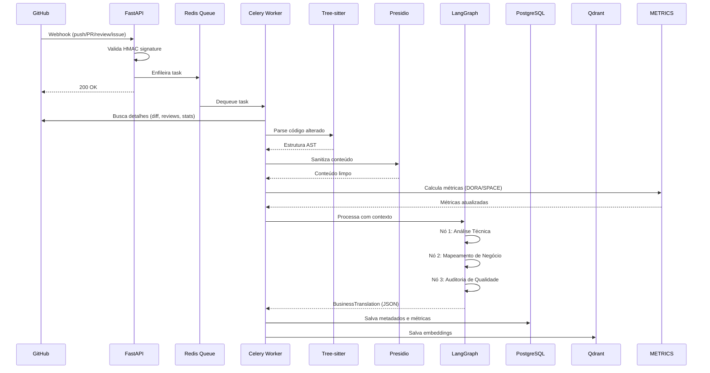
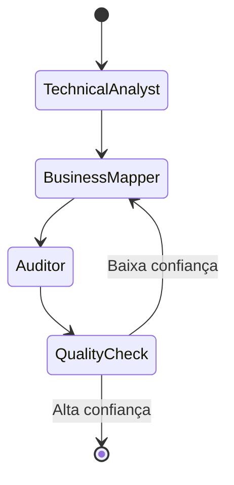
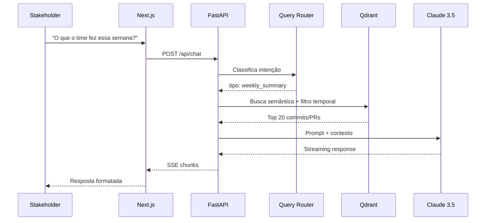

# Fluxo de Dados

Como os dados fluem desde um push no GitHub até uma resposta no Slack.

## Fluxo de Ingestão (Webhook → Storage)



## Detalhes por Etapa

### 1. Recebimento do Webhook

```python
@app.post("/webhooks/github")
async def receive_webhook(
    request: Request,
    x_hub_signature_256: str = Header()
):
    payload = await request.body()

    # Valida assinatura HMAC
    if not verify_signature(payload, x_hub_signature_256):
        raise HTTPException(401)

    # Enfileira para processamento async
    task_id = process_github_event.delay(payload)

    return {"status": "queued", "task_id": task_id}
```

### 2. Parsing AST (Tree-sitter)

Identifica **O QUE** mudou estruturalmente:

| Tipo de Mudança | Exemplo |
|-----------------|---------|
| Nova função | `def calculate_tax()` adicionada |
| Refactoring | `UserService` renomeado para `UserManager` |
| Mudança de modelo | Campo `email` adicionado ao `User` |
| Dependência | `requests` adicionado ao `requirements.txt` |

### 3. Sanitização (Presidio)

Remove informações sensíveis antes de enviar para a LLM:

| Tipo | Antes | Depois |
|------|-------|--------|
| Email | `pedro@email.com` | `<EMAIL>` |
| CPF | `123.456.789-00` | `<CPF>` |
| API Key | `sk-ant-api03-xxx` | `<API_KEY>` |
| URL privada | `https://internal.company.com` | `<INTERNAL_URL>` |

### 4. Processamento LangGraph



**Nó 1 - Technical Analyst:**
> "O que mudou tecnicamente? Quais arquivos, funções, classes?"

**Nó 2 - Business Mapper:**
> "Como isso afeta o negócio? Cruze com `.devbridge.yaml`."

**Nó 3 - Auditor:**
> "A linguagem está clara? O score de confiança é adequado?"

### 5. Saída Estruturada

```python
class BusinessTranslation(BaseModel):
    title: str
    technical_summary: str
    business_value: str
    risks_mitigated: List[str]
    aligned_pillars: List[str]
    metrics: List[ImpactMetrics]
```

---

## Fluxo de Consulta (Chat → Resposta)



## Tipos de Query e Roteamento

| Query | Tipo | Ação |
|-------|------|------|
| "O que foi feito essa semana?" | `weekly_summary` | Agregação por período |
| "Por que o PR #123 demorou?" | `pr_analysis` | Busca específica por PR |
| "Estamos progredindo nos OKRs?" | `okr_progress` | Cruza commits com metas |
| "O que o João fez?" | `developer_activity` | Filtro por autor |

## Próximos Passos

- [Arquitetura Overview](overview.md)
- [ADRs](decisions/) - decisões arquiteturais
