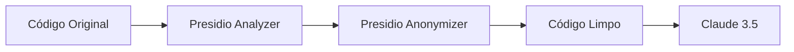

# ADR-003: Privacidade por Design com Microsoft Presidio

**Data:** 2025-01-01

**Status:** Accepted

**Deciders:** Pedro (Tech Lead)

## Contexto

O DevBridge processa código-fonte de repositórios privados, que frequentemente contém:

| Tipo de Dado Sensível | Exemplo |
|-----------------------|---------|
| PII (Dados Pessoais) | Emails, CPFs, telefones em comentários |
| Secrets | API Keys, tokens, senhas hardcoded |
| URLs Internas | Endpoints de staging/produção |
| IPs Privados | Configurações de infraestrutura |

Esses dados **não podem** ser enviados para LLMs externas (Claude/OpenAI).

## Decisão

> Usaremos **Microsoft Presidio** para detectar e sanitizar dados sensíveis antes de qualquer processamento por LLM.

### Pipeline de Sanitização



### Tipos Detectados

| Entidade | Substituição |
|----------|--------------|
| EMAIL_ADDRESS | `<EMAIL>` |
| PHONE_NUMBER | `<PHONE>` |
| CREDIT_CARD | `<CREDIT_CARD>` |
| CRYPTO | `<CRYPTO_KEY>` |
| IP_ADDRESS | `<IP>` |
| URL (interno) | `<INTERNAL_URL>` |
| API Key patterns | `<API_KEY>` |
| BR_CPF | `<CPF>` |
| PERSON | `<PERSON>` |

## Alternativas Consideradas

### Alternativa A: Regex Custom

- **Prós:** Simples, sem dependência externa
- **Contras:** 
  - Manter regex para cada tipo é trabalhoso
  - Falsos negativos em formatos variados
  - Não detecta contexto (ex: "meu CPF é...")
- **Por que descartada:** Muito frágil e incompleto

### Alternativa B: AWS Macie / Google DLP

- **Prós:** Serviços gerenciados, alta qualidade
- **Contras:**
  - Custo por volume de dados
  - Latência de rede
  - Vendor lock-in
- **Por que descartada:** Custo e dependência de cloud específica

### Alternativa C: Processamento Local Sem Sanitização

- **Prós:** Simples, sem overhead
- **Contras:** Viola regulamentações (LGPD, GDPR), risco reputacional
- **Por que descartada:** Inaceitável do ponto de vista legal e ético

## Consequências

### Positivas
- **Compliance:** Atende LGPD, GDPR, SOC2
- **Confiança:** Clientes podem usar com dados sensíveis
- **Auditabilidade:** Log de todas as sanitizações
- **Extensível:** Fácil adicionar novos recognizers

### Negativas
- **Latência:** ~50ms por processamento
- **Falsos positivos:** Pode marcar código válido como PII
- **Dependência:** Biblioteca pesada (~500MB com models)

### Neutras
- Necessidade de treinar recognizers customizados para padrões específicos

## Notas de Implementação

```python
from presidio_analyzer import AnalyzerEngine
from presidio_anonymizer import AnonymizerEngine

analyzer = AnalyzerEngine()
anonymizer = AnonymizerEngine()

def sanitize(text: str) -> str:
    results = analyzer.analyze(
        text=text,
        language="pt",  # Suporte a português
        entities=["EMAIL_ADDRESS", "PHONE_NUMBER", "CREDIT_CARD", ...]
    )
    return anonymizer.anonymize(text=text, analyzer_results=results).text
```

### Recognizers Customizados (Brasil)

```python
from presidio_analyzer import PatternRecognizer

cpf_recognizer = PatternRecognizer(
    supported_entity="BR_CPF",
    patterns=[
        Pattern(name="cpf", regex=r"\d{3}\.\d{3}\.\d{3}-\d{2}", score=0.9)
    ]
)
analyzer.registry.add_recognizer(cpf_recognizer)
```

## Links Relacionados

- [Microsoft Presidio](https://microsoft.github.io/presidio/)
- [LGPD - Lei Geral de Proteção de Dados](https://www.planalto.gov.br/ccivil_03/_ato2015-2018/2018/lei/l13709.htm)
- [ADR-002: AI Guardrails](./002-ai-guardrails.md)
