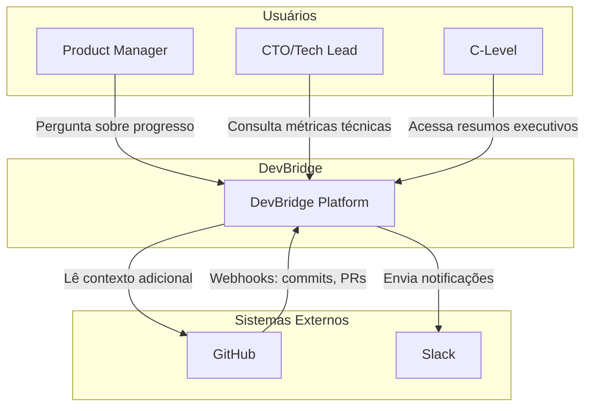
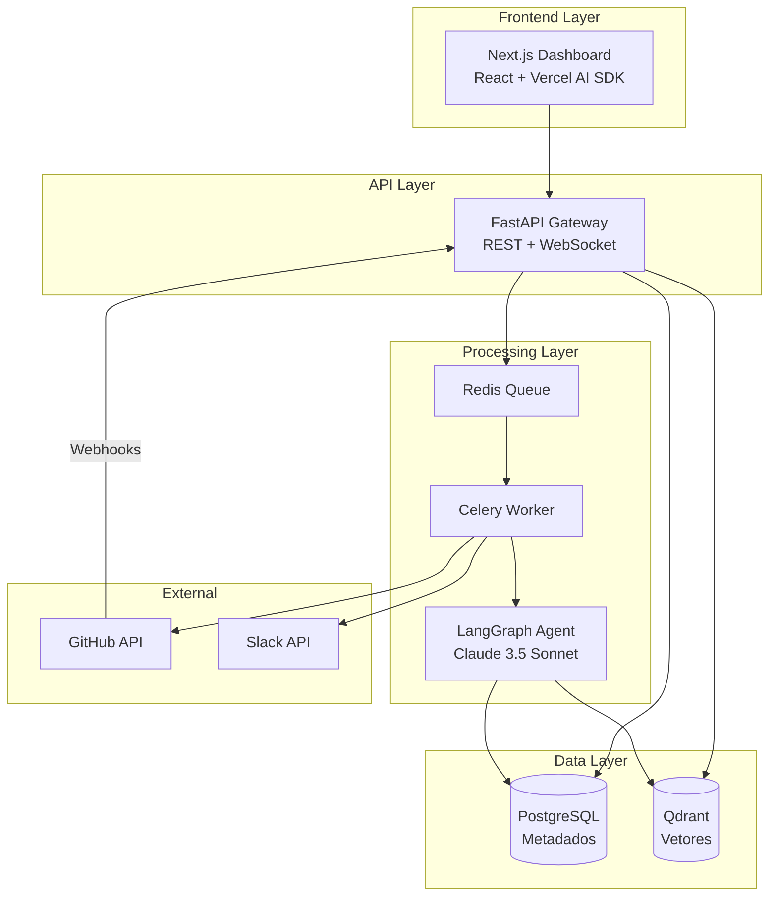

# Visão Geral da Arquitetura

O DevBridge segue o padrão **Event-Driven RAG Agent**, combinando processamento assíncrono de eventos com geração aumentada por recuperação (RAG).

## Diagrama de Contexto (C4 Level 1)

## Diagrama de Container (C4 Level 2)

## Componentes Principais

### 1. Camada de Ingestão

| Componente | Responsabilidade |
|------------|------------------|
| **FastAPI Gateway** | Recebe webhooks do GitHub, valida assinaturas, roteia para fila |
| **Redis Queue** | Buffer de tarefas para processamento assíncrono |
| **Celery Worker** | Processa tarefas em background |

### 2. Pipeline de Processamento (Extendida)

| Componente | Responsabilidade |
|------------|------------------|
| **Tree-sitter** | Parsing AST para entender estrutura do código |
| **Microsoft Presidio** | Sanitização de PII e secrets antes da LLM |
| **Context Injector** | Carrega `.devbridge.yaml` e contexto histórico |
| **MetricsService** | [NEW] Calcula métricas DORA, SPACE e agregações de perfil |

### 3. Camada de AI

| Componente | Responsabilidade |
|------------|------------------|
| **LangGraph Orchestrator** | Fluxo cíclico de análise (Técnico → Negócio → Auditor) |
| **AIService** | Tradução, Raciocínio (Claude 3.5 Sonnet) e Análise de Perfil (Strength Tags) |
| **Instructor + Pydantic** | Garante saída JSON estruturada |

### 4. Camada de Dados

| Componente | Responsabilidade |
|------------|------------------|
| **PostgreSQL** | Metadados relacionais, issues, code reviews, perfis e métricas |
| **Qdrant** | Busca semântica via embeddings |

### 5. Camada de Entrega

| Componente | Responsabilidade |
|------------|------------------|
| **Next.js Dashboard** | Interface de chat, dashboards DORA e perfis de desenvolvedor |
| **Slack Bot** | Notificações proativas ("Resumo do Dia") |

## Princípios Arquiteturais

### Zero Alucinação Financeira
A IA nunca "inventa" valores monetários. Só reporta impacto financeiro se houver métricas explícitas no `.devbridge.yaml`.

### Privacidade por Design
Todo dado passa por sanitização (Presidio) antes de chegar à LLM. PII, API Keys e secrets são substituídos por `<REDACTED>`.

### Saída Estruturada
A LLM nunca retorna texto livre. Todas as respostas são objetos Pydantic validados, garantindo consistência no frontend.

### Push over Pull
O sistema notifica stakeholders proativamente (Slack) ao invés de esperar que eles consultem.

## Decisões Arquiteturais

Veja os [ADRs](decisions/) para detalhes sobre decisões específicas:

- [ADR-001: Escolha de Stack](decisions/001-stack-choice.md)
- [ADR-002: Guardrails de AI](decisions/002-ai-guardrails.md)
- [ADR-003: Privacidade por Design](decisions/003-privacy-by-design.md)
- [ADR-006: Modelo de Dados Multi-Tenant](decisions/006-saas-data-model.md)
- [ADR-009: Rastreamento de Esforço](decisions/009-developer-effort-tracking.md)

## Próximos Passos

- [Fluxo de Dados](data-flow.md) - como os dados fluem pelo sistema
- [Regras de Negócio](../business/rules-catalog.md) - catálogo completo
