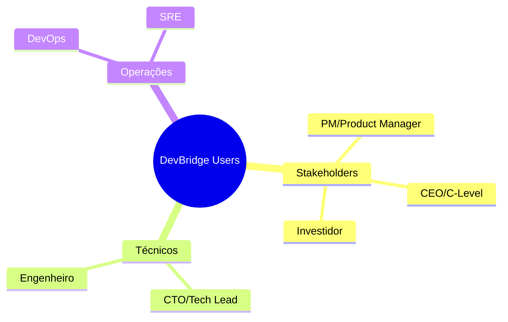

# Personas

Definição dos perfis de usuário do DevBridge e suas necessidades específicas.

---

## Visão Geral



---

## Persona 1: Product Manager (Maria)

### Perfil

| Atributo | Valor |
|----------|-------|
| **Cargo** | Product Manager |
| **Background** | Negócios, Design |
| **Conhecimento Técnico** | Básico |
| **Tempo Disponível** | Limitado |

### Necessidades

- Entender progresso do time sem reuniões
- Reportar status para stakeholders
- Priorizar backlog com contexto técnico
- Identificar riscos antes que impactem cronograma

### Perguntas Típicas

- "O que o time entregou essa semana?"
- "Por que a feature X atrasou?"
- "Estamos no caminho para atingir a meta do quarter?"
- "Qual o impacto do refactoring que o time está fazendo?"

### Nível de Detalhe Preferido

**Outcome-focused** - foco em resultados e impacto, não em detalhes técnicos.

### Exemplo de Resposta Ideal

> "O time concluiu a otimização do checkout, reduzindo o tempo de carregamento em 40%. Isso deve aumentar a conversão em ~2% baseado nos dados do A/B test. O refactoring do módulo de pagamentos está 70% completo e reduzirá bugs de transação pela metade."

---

## Persona 2: CTO / Tech Lead (André)

### Perfil

| Atributo | Valor |
|----------|-------|
| **Cargo** | CTO ou Tech Lead |
| **Background** | Engenharia de Software |
| **Conhecimento Técnico** | Avançado |
| **Tempo Disponível** | Médio |

### Necessidades

- Visibilidade sobre decisões técnicas do time
- Identificar dívida técnica acumulando
- Avaliar qualidade e consistência do código
- Preparar reports para board/CEO

### Perguntas Típicas

- "Qual o status da migração de arquitetura?"
- "Onde está concentrada a dívida técnica?"
- "Como está o coverage de testes?"
- "Quais decisões arquiteturais foram tomadas no último mês?"

### Nível de Detalhe Preferido

**Technical** - quer detalhes técnicos mas sintetizados, com métricas.

### Exemplo de Resposta Ideal

> "A migração para microserviços está 75% completa (12/16 serviços). O serviço de pagamentos foi refatorado: complexidade ciclomática caiu de 25 para 12, coverage subiu de 45% para 78%. Decisões notáveis: adotamos Circuit Breaker pattern (ADR-015) e Event Sourcing para transações (ADR-016)."

---

## Persona 3: CEO / C-Level (Roberto)

### Perfil

| Atributo | Valor |
|----------|-------|
| **Cargo** | CEO, CFO, COO |
| **Background** | Gestão, Finanças |
| **Conhecimento Técnico** | Mínimo |
| **Tempo Disponível** | Muito Limitado |

### Necessidades

- Resumo executivo de 30 segundos
- Entender se engenharia está alinhada com estratégia
- Identificar riscos de alto nível
- Dados para board meetings

### Perguntas Típicas

- "Tech está contribuindo para os OKRs?"
- "Quais são os maiores riscos técnicos?"
- "Estamos investindo bem em tecnologia?"
- "O que fizemos para reduzir custos de infra?"

### Nível de Detalhe Preferido

**Executive Summary** - 3-5 bullet points máximo, linguagem 100% não-técnica.

### Exemplo de Resposta Ideal

> **Resumo Executivo - Dezembro**
> - ✅ **Conversão:** Melhorias técnicas aumentaram conversão em 2.1% (meta: 2%)
> - ✅ **Custos:** Otimizações reduziram custo de cloud em 18%
> - ⚠️ **Risco:** Dependência crítica de 1 desenvolvedor em sistema de pagamentos
> - 📊 **Velocity:** Time 12% mais produtivo que mês anterior

---

## Persona 4: Engenheiro (Carla)

### Perfil

| Atributo | Valor |
|----------|-------|
| **Cargo** | Software Engineer |
| **Background** | Ciência da Computação |
| **Conhecimento Técnico** | Avançado |
| **Tempo Disponível** | Alto |

### Necessidades

- Entender contexto de código legado
- Saber o que colegas trabalharam recentemente
- Onboarding rápido em novas áreas
- Evitar duplicação de esforço

### Perguntas Típicas

- "Quem trabalhou no módulo de notificações recentemente?"
- "Por que essa função foi implementada dessa forma?"
- "Quais PRs estão relacionados a este arquivo?"
- "O que mudou na última sprint no serviço X?"

### Nível de Detalhe Preferido

**Full Technical** - detalhes de implementação, links para código.

---

## Configuração no .devbridge.yaml

```yaml
audience_profiles:
  - role: "pm"
    detail_level: "outcome-focused"
    language: "pt-BR"
    
  - role: "cto"
    detail_level: "technical"
    language: "pt-BR"
    include_metrics: true
    
  - role: "ceo"
    detail_level: "executive-summary"
    language: "pt-BR"
    max_bullets: 5
    
  - role: "engineer"
    detail_level: "full-technical"
    language: "pt-BR"
    include_code_links: true
```

---

## Matriz de Necessidades

| Persona | Frequência de Uso | Formato Preferido | Canais |
|---------|------------------|-------------------|--------|
| PM | Diário | Chat, Resumos | Dashboard, Slack |
| CTO | Semanal | Reports | Dashboard, Email |
| CEO | Mensal | Executive Summary | Dashboard, Email |
| Engineer | Diário | Chat | Dashboard, IDE |
