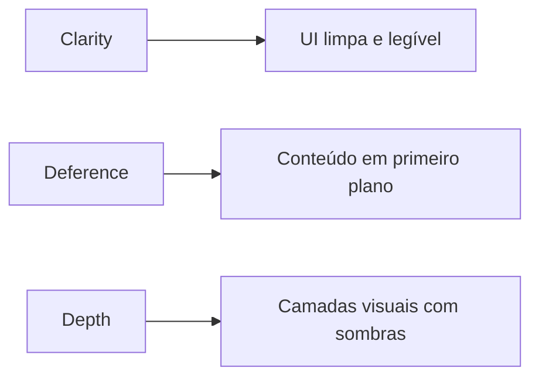

# Design System

Documentação do sistema de design do DevBridge, inspirado nos princípios do Apple Human Interface Guidelines (HIG).

## Documentos

| Documento | Descrição |
|-----------|-----------|
| [Foundations](foundations.md) | **Design Tokens**: Cores, tipografia, espaçamento, sombras |
| [Components](components.md) | Componentes de UI: Buttons, Inputs, Cards |
| [Brand](brand.md) | Identidade visual: Logo, voz, iconografia |

## Princípios de Design

### 1. Clarity (Clareza)
- Tipografia legível em todos os tamanhos
- Hierarquia visual clara
- Iconografia intuitiva

### 2. Deference (Deferência)
- Interface não compete com o conteúdo
- Cores sutis para elementos secundários
- Foco na tarefa do usuário

### 3. Depth (Profundidade)
- Sombras sutis para indicar elevação
- Camadas visuais para separar contextos
- Transições suaves entre estados
