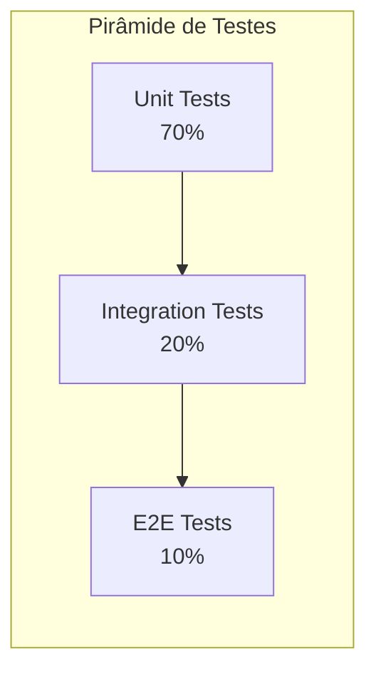

# Estratégia de Testes

Guia para escrever e organizar testes no DevBridge.

---

## Visão Geral



| Tipo | Coverage Target | Velocidade | Escopo |
|------|-----------------|------------|--------|
| Unit | 80%+ | Rápido (<100ms) | Uma função/classe |
| Integration | 60%+ | Médio (<5s) | Componentes integrados |
| E2E | Critical paths | Lento (<30s) | Fluxos completos |

---

## Unit Tests

### Estrutura

```
backend/
└── tests/
    ├── unit/
    │   ├── engine/
    │   │   ├── test_parsing.py
    │   │   ├── test_scrubbing.py
    │   │   └── test_agents.py
    │   ├── models/
    │   │   └── test_translation.py
    │   └── services/
    │       └── test_github.py
    └── conftest.py
```

### Padrões

#### Nomenclatura

```python
# test_<modulo>.py
# test_<função>_<cenario>_<resultado_esperado>

def test_sanitize_content_with_email_returns_redacted():
    ...

def test_sanitize_content_without_pii_returns_unchanged():
    ...

def test_analyze_commit_with_empty_diff_raises_error():
    ...
```

#### AAA Pattern (Arrange, Act, Assert)

```python
def test_business_translation_validates_confidence_score():
    # Arrange
    invalid_data = {
        "title": "Test",
        "technical_summary": "Summary",
        "business_value": "Value",
        "risks_mitigated": [],
        "aligned_pillars": [],
        "metrics": [],
        "confidence_score": 150  # Inválido: > 100
    }
    
    # Act & Assert
    with pytest.raises(ValidationError) as exc:
        BusinessTranslation(**invalid_data)
    
    assert "confidence_score" in str(exc.value)
```

#### Fixtures

```python
# conftest.py
import pytest
from app.models.translation import BusinessTranslation


@pytest.fixture
def sample_translation() -> BusinessTranslation:
    """Fixture para tradução válida."""
    return BusinessTranslation(
        title="Otimização de Checkout",
        technical_summary="Refatorou 3 funções de pagamento",
        business_value="Reduz tempo de checkout em 40%",
        risks_mitigated=["Bug de timeout"],
        aligned_pillars=["conv_rate"],
        metrics=[],
    )


@pytest.fixture
def mock_github_client(mocker):
    """Mock do cliente GitHub."""
    mock = mocker.patch("app.services.github.GitHubClient")
    mock.return_value.get_diff.return_value = "diff content"
    return mock
```

#### Parametrização

```python
import pytest


@pytest.mark.parametrize("input_text,expected", [
    ("email@test.com", "<EMAIL>"),
    ("123.456.789-00", "<CPF>"),
    ("sk-ant-api03-xxx", "<API_KEY>"),
    ("texto normal", "texto normal"),
])
def test_sanitize_content_handles_various_pii(input_text: str, expected: str):
    result = sanitize_content(input_text)
    assert result == expected
```

---

## Integration Tests

### Estrutura

```
backend/
└── tests/
    └── integration/
        ├── test_webhook_flow.py
        ├── test_rag_pipeline.py
        └── test_agent_workflow.py
```

### Fixtures de Infraestrutura

```python
# conftest.py
import pytest
from testcontainers.postgres import PostgresContainer
from testcontainers.redis import RedisContainer


@pytest.fixture(scope="session")
def postgres():
    """Container PostgreSQL para testes."""
    with PostgresContainer("postgres:15") as postgres:
        yield postgres


@pytest.fixture(scope="session")
def redis():
    """Container Redis para testes."""
    with RedisContainer("redis:7") as redis:
        yield redis


@pytest.fixture
def test_db(postgres):
    """Database limpo para cada teste."""
    engine = create_engine(postgres.get_connection_url())
    Base.metadata.create_all(engine)
    yield engine
    Base.metadata.drop_all(engine)
```

### Exemplo

```python
@pytest.mark.integration
async def test_webhook_processes_commit_and_stores_translation(
    test_db, 
    mock_llm,
    sample_webhook_payload
):
    # Arrange
    webhook_service = WebhookService(db=test_db)
    
    # Act
    result = await webhook_service.process(sample_webhook_payload)
    
    # Assert
    assert result.status == "processed"
    
    # Verifica persistência
    translations = test_db.query(Translation).all()
    assert len(translations) == 1
    assert translations[0].commit_sha == sample_webhook_payload["head_commit"]["id"]
```

---

## E2E Tests

### Estrutura

```
frontend/
└── e2e/
    ├── chat.spec.ts
    ├── dashboard.spec.ts
    └── fixtures/
        └── auth.ts
```

### Playwright

```typescript
// chat.spec.ts
import { test, expect } from '@playwright/test';

test.describe('Chat Interface', () => {
  test('should send message and receive response', async ({ page }) => {
    // Arrange
    await page.goto('/chat');
    
    // Act
    await page.fill('[data-testid="chat-input"]', 'O que o time fez?');
    await page.click('[data-testid="send-button"]');
    
    // Assert
    await expect(page.locator('[data-testid="message-assistant"]')).toBeVisible({
      timeout: 10000
    });
    
    const response = await page.textContent('[data-testid="message-assistant"]');
    expect(response).toContain('time');
  });

  test('should show loading state while processing', async ({ page }) => {
    await page.goto('/chat');
    
    await page.fill('[data-testid="chat-input"]', 'Teste');
    await page.click('[data-testid="send-button"]');
    
    await expect(page.locator('[data-testid="loading-indicator"]')).toBeVisible();
  });
});
```

---

## Mocking

### LLM Mocking

```python
# Nunca chama LLM real em testes
@pytest.fixture
def mock_llm(mocker):
    """Mock do Claude para testes."""
    mock = mocker.patch("app.engine.agents.get_llm_client")
    mock.return_value.chat.completions.create.return_value = MockResponse(
        content=BusinessTranslation(
            title="Mock Translation",
            technical_summary="Mock summary",
            business_value="Mock value",
            risks_mitigated=[],
            aligned_pillars=[],
            metrics=[],
        ).model_dump_json()
    )
    return mock
```

### External Services

```python
@pytest.fixture
def mock_github(mocker):
    """Mock da API do GitHub."""
    mock = mocker.patch("app.services.github.httpx.AsyncClient")
    mock.return_value.__aenter__.return_value.get.return_value = MockResponse(
        status_code=200,
        json={"sha": "abc123", "files": []}
    )
    return mock
```

---

## Executando Testes

```bash
# Todos os testes
poetry run pytest

# Com coverage
poetry run pytest --cov=app --cov-report=html

# Apenas unit tests
poetry run pytest tests/unit/

# Apenas integration tests
poetry run pytest tests/integration/ -m integration

# Testes específicos
poetry run pytest tests/unit/engine/test_parsing.py -k "test_parse"

# Com output verboso
poetry run pytest -v

# Parar no primeiro erro
poetry run pytest -x
```

---

## CI Pipeline

```yaml
# .github/workflows/test.yml
name: Tests

on: [push, pull_request]

jobs:
  test:
    runs-on: ubuntu-latest
    
    services:
      postgres:
        image: postgres:15
        env:
          POSTGRES_PASSWORD: postgres
        ports:
          - 5432:5432
    
    steps:
      - uses: actions/checkout@v4
      
      - name: Setup Python
        uses: actions/setup-python@v5
        with:
          python-version: '3.11'
      
      - name: Install dependencies
        run: |
          pip install poetry
          poetry install
      
      - name: Run tests
        run: poetry run pytest --cov=app
      
      - name: Upload coverage
        uses: codecov/codecov-action@v3
```

---

## Métricas

| Métrica | Target | Atual |
|---------|--------|-------|
| Line Coverage | 80% | - |
| Branch Coverage | 70% | - |
| Test Pass Rate | 100% | - |
