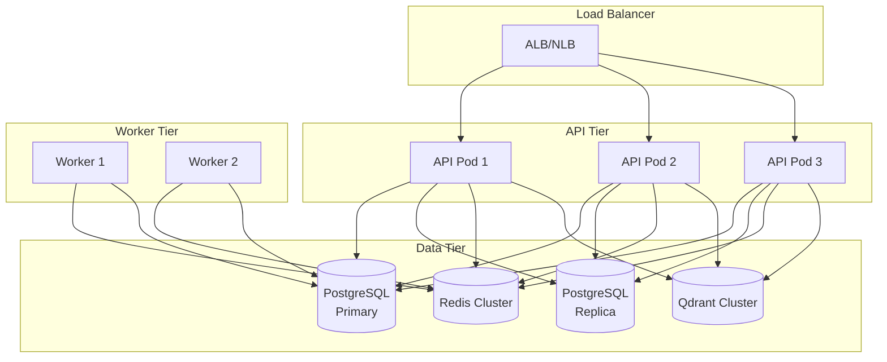

# Guia de Deploy

Como implantar o DevBridge em diferentes ambientes.

---

## Ambientes

| Ambiente | Uso | URL |
|----------|-----|-----|
| Development | Desenvolvimento local | `localhost` |
| Staging | Testes pré-produção | `staging.devbridge.io` |
| Production | Produção | `devbridge.io` |

---

## Deploy Local (Docker Compose)

### Pré-requisitos

- Docker 24+
- Docker Compose 2.20+
- 4GB RAM disponível

### Passos

```bash
# 1. Clone e configure
git clone https://github.com/seu-usuario/devbridge.git
cd devbridge
cp .env.example .env

# 2. Edite .env com suas credenciais

# 3. Suba todos os serviços
docker-compose up -d

# 4. Verifique status
docker-compose ps

# 5. Veja logs
docker-compose logs -f
```

### Serviços

| Serviço | Porta | Descrição |
|---------|-------|-----------|
| api | 8000 | FastAPI Backend |
| worker | - | Celery Worker |
| postgres | 5432 | Database |
| redis | 6379 | Cache e Queue |
| qdrant | 6333 | Vector DB |
| frontend | 3000 | Next.js |

---

## Deploy Staging

### Infraestrutura

- **Cloud:** AWS / GCP / Azure
- **Container:** Kubernetes ou ECS
- **Database:** Managed PostgreSQL
- **Cache:** Managed Redis

### Kubernetes

```yaml
# k8s/deployment.yaml
apiVersion: apps/v1
kind: Deployment
metadata:
  name: devbridge-api
  namespace: staging
spec:
  replicas: 2
  selector:
    matchLabels:
      app: devbridge-api
  template:
    metadata:
      labels:
        app: devbridge-api
    spec:
      containers:
        - name: api
          image: devbridge/api:staging
          ports:
            - containerPort: 8000
          env:
            - name: DATABASE_URL
              valueFrom:
                secretKeyRef:
                  name: devbridge-secrets
                  key: database-url
          resources:
            requests:
              memory: "512Mi"
              cpu: "250m"
            limits:
              memory: "1Gi"
              cpu: "500m"
```

### Helm Chart

```bash
# Instalar/atualizar
helm upgrade --install devbridge ./charts/devbridge \
  --namespace staging \
  --values values-staging.yaml \
  --set image.tag=latest
```

---

## Deploy Produção

### Checklist Pré-Deploy

- [ ] Testes passando em staging
- [ ] Migrations testadas
- [ ] Secrets configurados
- [ ] Backups verificados
- [ ] Rollback plan documentado
- [ ] Monitoring configurado

### Arquitetura de Produção



### CI/CD Pipeline

```yaml
# .github/workflows/deploy.yml
name: Deploy Production

on:
  push:
    tags:
      - 'v*'

jobs:
  deploy:
    runs-on: ubuntu-latest
    environment: production
    
    steps:
      - uses: actions/checkout@v4
      
      - name: Build and push image
        run: |
          docker build -t devbridge/api:${{ github.ref_name }} .
          docker push devbridge/api:${{ github.ref_name }}
      
      - name: Deploy to Kubernetes
        run: |
          kubectl set image deployment/devbridge-api \
            api=devbridge/api:${{ github.ref_name }} \
            --namespace production
      
      - name: Wait for rollout
        run: |
          kubectl rollout status deployment/devbridge-api \
            --namespace production \
            --timeout=300s
```

---

## Migrations

### Antes do Deploy

```bash
# Gerar migration
poetry run alembic revision --autogenerate -m "description"

# Review da migration gerada
cat alembic/versions/xxx_description.py

# Testar em staging
poetry run alembic upgrade head
```

### Durante Deploy

```bash
# Migrations são executadas pelo init container
kubectl logs -f deployment/devbridge-api -c migrations
```

### Rollback

```bash
# Voltar uma versão
poetry run alembic downgrade -1

# Voltar para revisão específica
poetry run alembic downgrade abc123
```

---

## Rollback

### Kubernetes

```bash
# Ver histórico
kubectl rollout history deployment/devbridge-api -n production

# Rollback para versão anterior
kubectl rollout undo deployment/devbridge-api -n production

# Rollback para versão específica
kubectl rollout undo deployment/devbridge-api --to-revision=3 -n production
```

### Docker Compose

```bash
# Pull versão anterior
docker-compose pull api
docker-compose up -d api
```

---

## Variáveis de Ambiente por Ambiente

| Variável | Dev | Staging | Prod |
|----------|-----|---------|------|
| `LOG_LEVEL` | DEBUG | INFO | WARNING |
| `DB_POOL_SIZE` | 5 | 10 | 20 |
| `CELERY_CONCURRENCY` | 2 | 4 | 8 |
| `CORS_ORIGINS` | `["*"]` | staging URLs | prod URLs |

---

## Troubleshooting Deploy

### Pod não inicia

```bash
kubectl describe pod <pod-name> -n production
kubectl logs <pod-name> -n production --previous
```

### Conexão com banco falha

```bash
# Verificar secrets
kubectl get secret devbridge-secrets -o yaml

# Testar conexão
kubectl run psql-test --rm -it --image=postgres:15 -- \
  psql $DATABASE_URL -c "SELECT 1"
```

### Health check falha

```bash
# Verificar endpoint diretamente
kubectl port-forward svc/devbridge-api 8000:8000
curl http://localhost:8000/health
```
