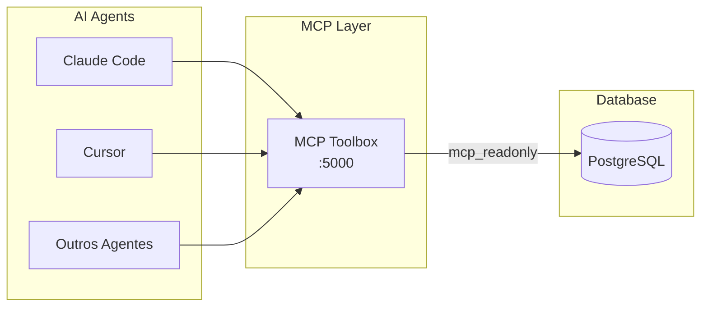

# Integração MCP Toolbox

O MCP Toolbox fornece acesso **read-only** ao banco de dados PostgreSQL do DevBridge para agentes de IA.

---

## Visão Geral



## Configuração

### 1. Iniciar o Toolbox

```bash
cd mcp-toolbox
./toolbox --tools_file tools-secure.yaml --address 127.0.0.1 --port 5000
```

### 2. Verificar Health

```bash
curl http://localhost:5000/health
```

### 3. Configurar o Agente

**Para Claude Code / Cursor:**

1. Adicione ao arquivo de configuração MCP:

```json
{
  "servers": {
    "devbridge-db": {
      "command": "./mcp-toolbox/toolbox",
      "args": ["--tools_file", "mcp-toolbox/tools-secure.yaml"]
    }
  }
}
```

---

## Modelo de Segurança

| Aspecto | Política |
|---------|----------|
| **Usuário** | `mcp_readonly` |
| **Permissões** | SELECT apenas |
| **Schemas** | `public` apenas |
| **Network** | Localhost (127.0.0.1) |

### Usuário de Banco

```sql
-- Criado pelo setup.sh
CREATE USER mcp_readonly WITH PASSWORD 'secure-password';
GRANT CONNECT ON DATABASE devbridge TO mcp_readonly;
GRANT USAGE ON SCHEMA public TO mcp_readonly;
GRANT SELECT ON ALL TABLES IN SCHEMA public TO mcp_readonly;

-- Para novas tabelas
ALTER DEFAULT PRIVILEGES IN SCHEMA public
GRANT SELECT ON TABLES TO mcp_readonly;
```

---

## Tools Disponíveis

### `query_repositories`

Lista repositórios monitorados.

| Parâmetro | Tipo | Descrição |
|-----------|------|-----------|
| `name` | string | Filtrar por nome (opcional) |
| `limit` | int | Máximo de resultados (default: 10) |

### `query_commits`

Busca commits por vários critérios.

| Parâmetro | Tipo | Descrição |
|-----------|------|-----------|
| `repository_id` | UUID | ID do repositório |
| `author` | string | Filtrar por autor |
| `since` | datetime | Data inicial |
| `until` | datetime | Data final |
| `limit` | int | Máximo de resultados |

### `query_translations`

Recupera traduções de negócio.

| Parâmetro | Tipo | Descrição |
|-----------|------|-----------|
| `min_confidence` | int | Score mínimo (0-100) |
| `pillar` | string | Filtrar por pilar de negócio |
| `limit` | int | Máximo de resultados |

### `query_metrics`

Retorna métricas agregadas.

| Parâmetro | Tipo | Descrição |
|-----------|------|-----------|
| `repository_id` | UUID | ID do repositório |
| `period` | string | `day`, `week`, `month` |

---

## Exemplos de Uso

### Listar Repositórios

```
> Use query_repositories with limit=5
```

### Commits Recentes

```
> Use query_commits with repository_id="uuid" and limit=10
```

### Traduções com Alta Confiança

```
> Use query_translations with min_confidence=80 and limit=5
```

---

## Troubleshooting

| Problema | Solução |
|----------|---------|
| Connection refused | Verificar se toolbox está rodando na porta 5000 |
| Query timeout | Adicionar filtros mais específicos |
| Permission denied | Verificar se está usando ferramentas read-only |
| Resultados vazios | Verificar filtros de repository_id e datas |

---

## Arquivos Relacionados

| Arquivo | Descrição |
|---------|-----------|
| [`mcp-toolbox/AGENTS.md`](../../mcp-toolbox/AGENTS.md) | Instruções para agentes |
| [`mcp-toolbox/CLAUDE.md`](../../mcp-toolbox/CLAUDE.md) | Instruções Claude |
| [`mcp-toolbox/tools-secure.yaml`](../../mcp-toolbox/tools-secure.yaml) | Definição das tools |
| [`mcp-toolbox/SECURITY.md`](../../mcp-toolbox/SECURITY.md) | Políticas de segurança |
